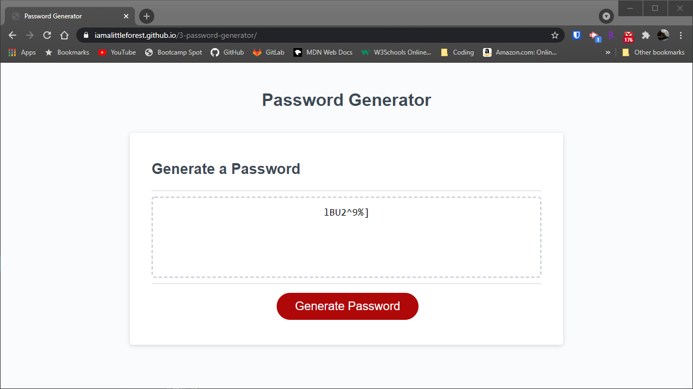
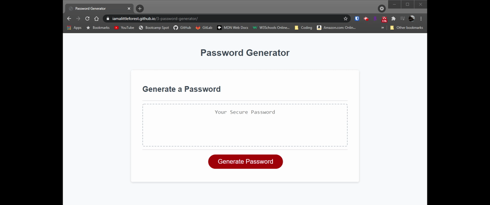

# Password Generator

## Link
https://iamalittleforest.github.io/3-password-generator/

## Languages & Technologies 
* HTML
* CSS
* Javascript

## Description
This application enables users to generate random passwords based on criteria that they have selected. This application runs in the browser and features dynamically updated HTML and CSS that is powered by Javascript.

## Screenshot

## Demo

## License
MIT License

## Contact Information
Wendy Kobayashi (<wykobayashi@gmail.com>)